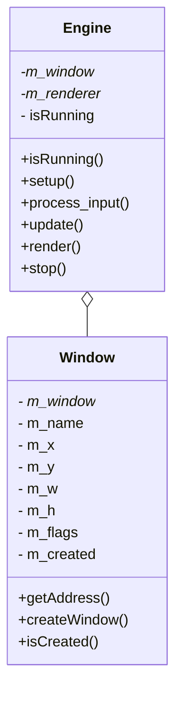

```mermaid
classDiagram
    Engine o-- Window
    
    Engine : +isRunning()
    Engine : +setup()
    Engine : +process_input()
    Engine : +update()
    Engine : +render()
    Engine : +stop()
    Engine : -m_window*
    Engine : -m_renderer*
    Engine : - isRunning
    
    Window : +getAddress()
    Window : +createWindow()
    Window : +isCreated()
    Window : - m_window*
    Window : - m_name
    Window : - m_x
    Window : - m_y
    Window : - m_w
    Window : - m_h
    Window : - m_flags
    Window : - m_created
    
```