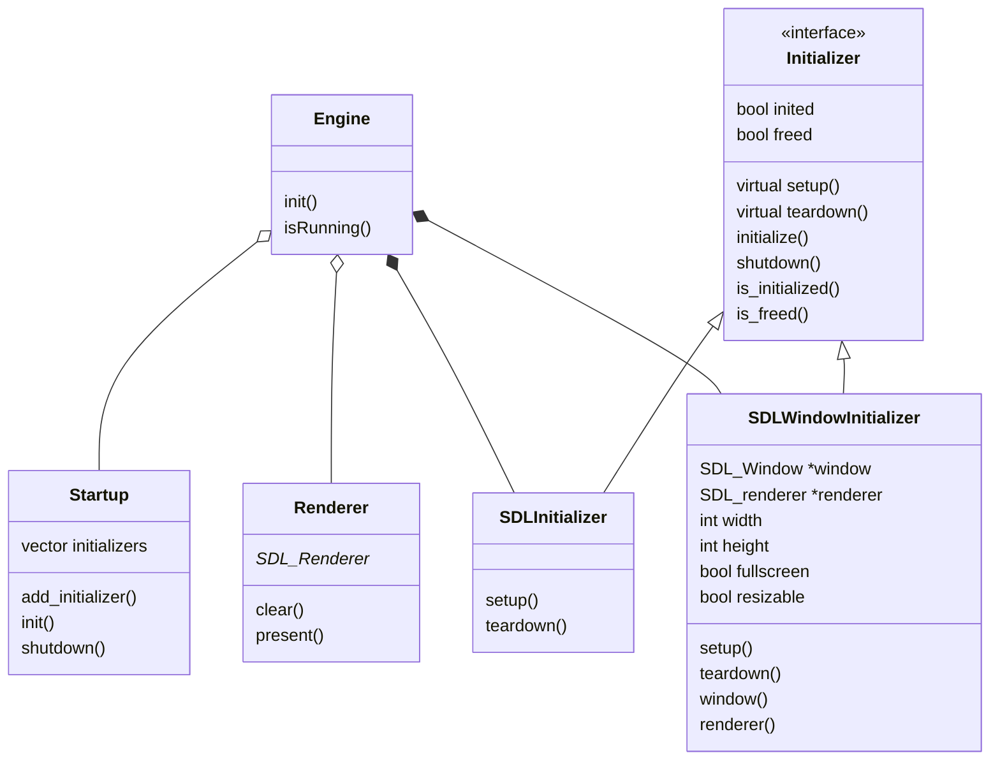

```mermaid
classDiagram
    class Engine
    class Initializer
    <<interface>> Initializer
    class Renderer
    class Startup

    Engine o-- Startup
    Engine o-- Renderer
    Engine *-- SDLInitializer
    Engine *-- SDLWindowInitializer

    Initializer <|-- SDLInitializer
    Initializer <|-- SDLWindowInitializer
    
    
    Engine : init()
    Engine : isRunning()
    
    Renderer : clear()
    Renderer : present()
    Renderer : SDL_Renderer *
    
    
    Initializer : virtual setup()
    Initializer : virtual teardown()
    Initializer : initialize()
    Initializer : shutdown()
    Initializer : is_initialized()
    Initializer : is_freed()
    Initializer : bool inited
    Initializer : bool freed
    
    Startup : add_initializer()
    Startup : init()
    Startup : shutdown()
    Startup : vector<Initializer> initializers
    
    SDLInitializer : setup()
    SDLInitializer : teardown()
    
    SDLWindowInitializer : setup()
    SDLWindowInitializer : teardown()
    SDLWindowInitializer : window()
    SDLWindowInitializer : renderer()
    SDLWindowInitializer : SDL_Window *window
    SDLWindowInitializer : SDL_renderer *renderer
    SDLWindowInitializer : int width
    SDLWindowInitializer : int height
    SDLWindowInitializer : bool fullscreen
    SDLWindowInitializer : bool resizable
    
```